# E-SHOP Web Application
---
## Main opportunities:
- Viewing products, detailed view of characteristics
- Product filtering
- Add products to the bucket
- Formation of orders and payment by card with confirmation by sms
- Authentication and registration with activated by email
- Application protection
- Validation of input data at the front and back level
- Additional features for ADMIN and MANAGER account(addProduct(),addUser() and so on)
- Email notification of new discounts

### Tech stack:
+ Java 11SE
+ Spring (Web,Data,Security,Boot)
+ Spring Mail Sender
+ Thymeleaf
+ MySql db
+ Lombok
+ Flyway

### Application launch:
1. Use link for clone and launch in IDE:    [github](https://github.com/ArturZimin/SpringBootEShop.git)
2. Create database and fix data in the file application.yaml: ``` datasource:
   url: jdbc:mysql://localhost:3306/eshopdb
   username: root
   password: 7001  ```
3. Run application from bash: (gradle)
### Screenshots of user API
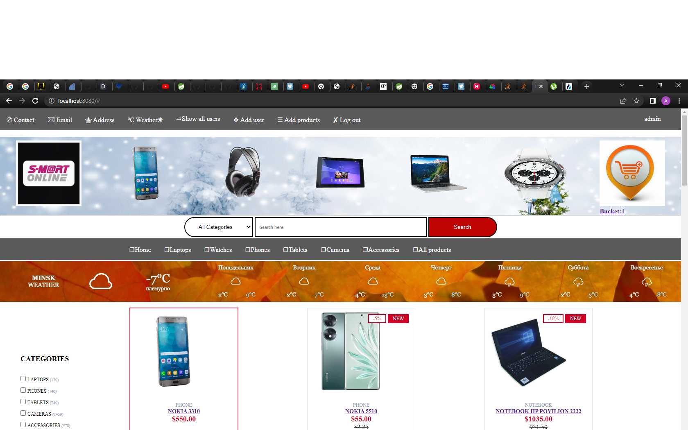
 ***
 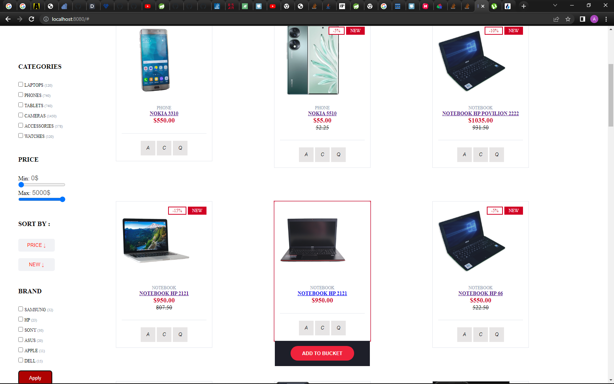
 ***
 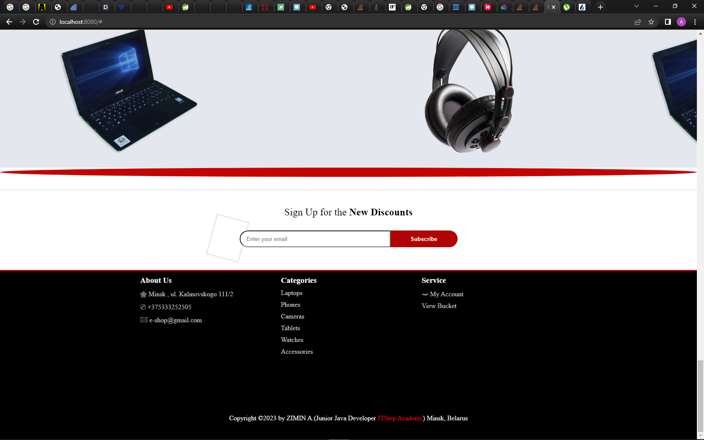
***
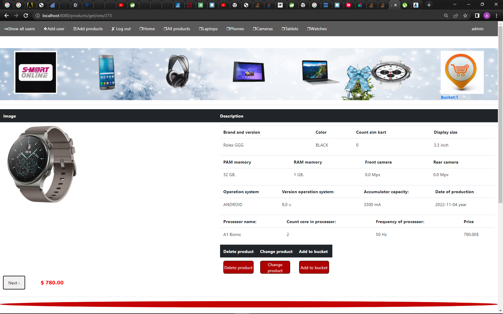
***
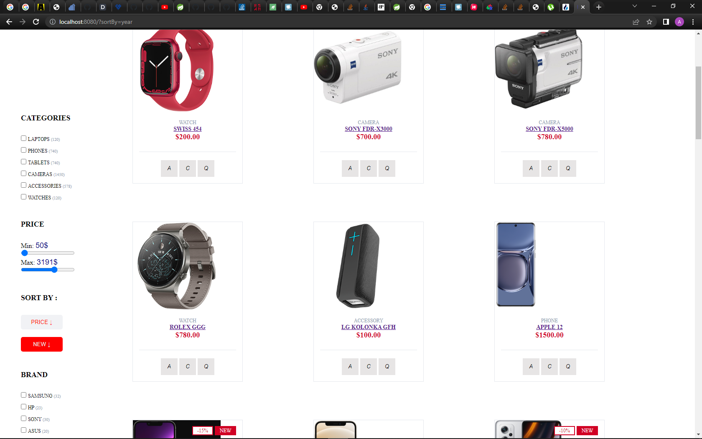
***
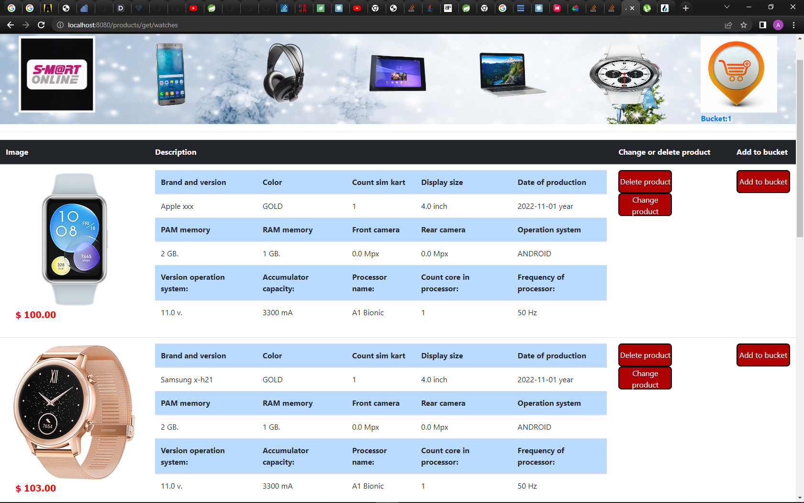
***
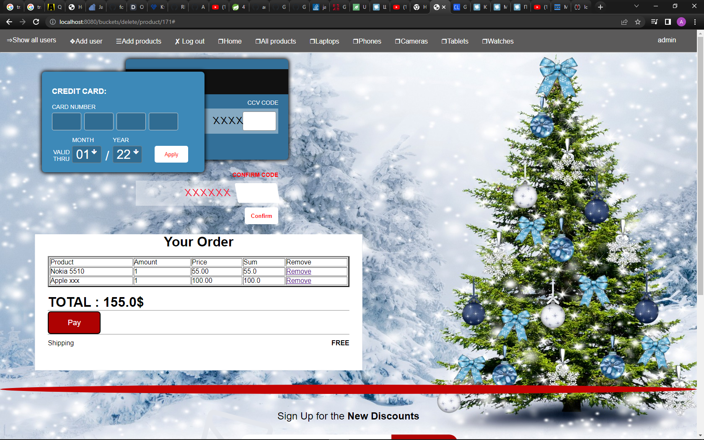
***

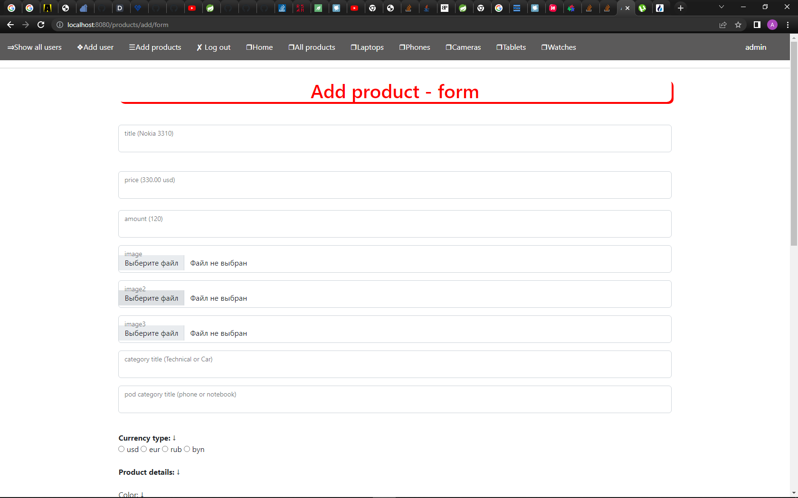

***

***
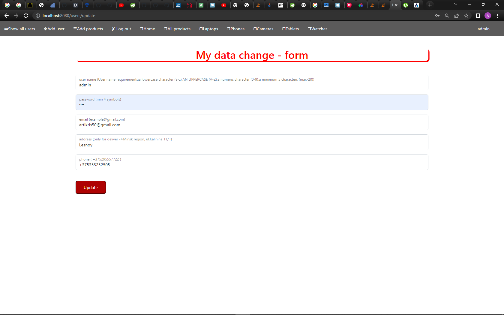
***

***
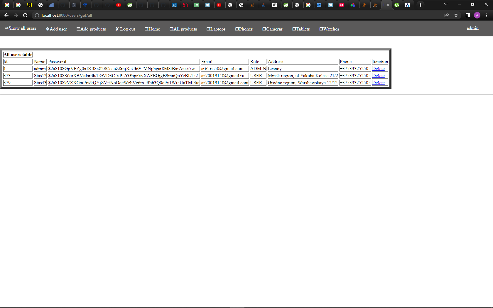
***
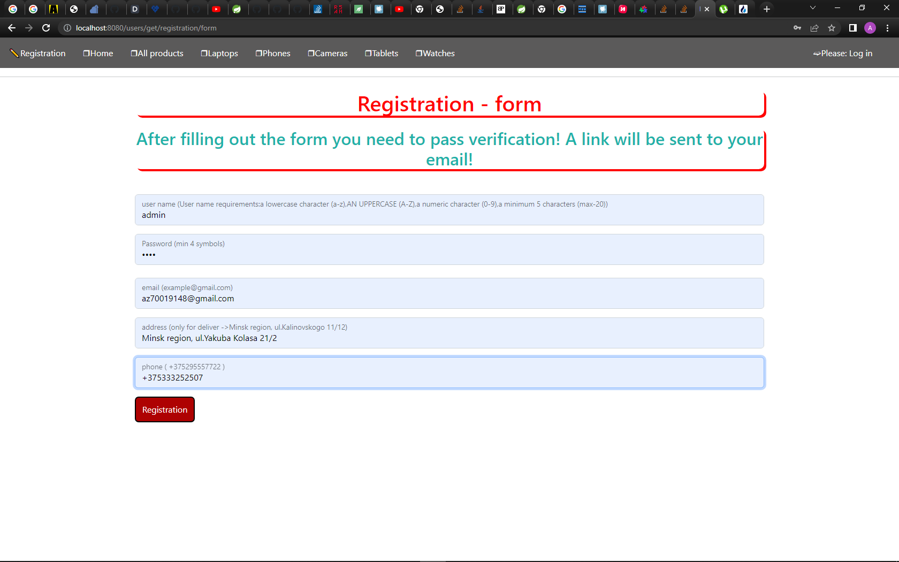
***
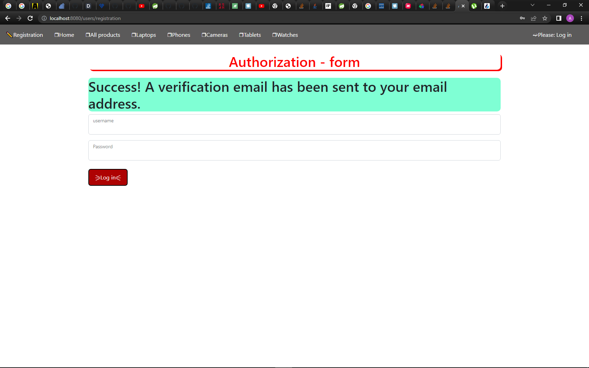
***
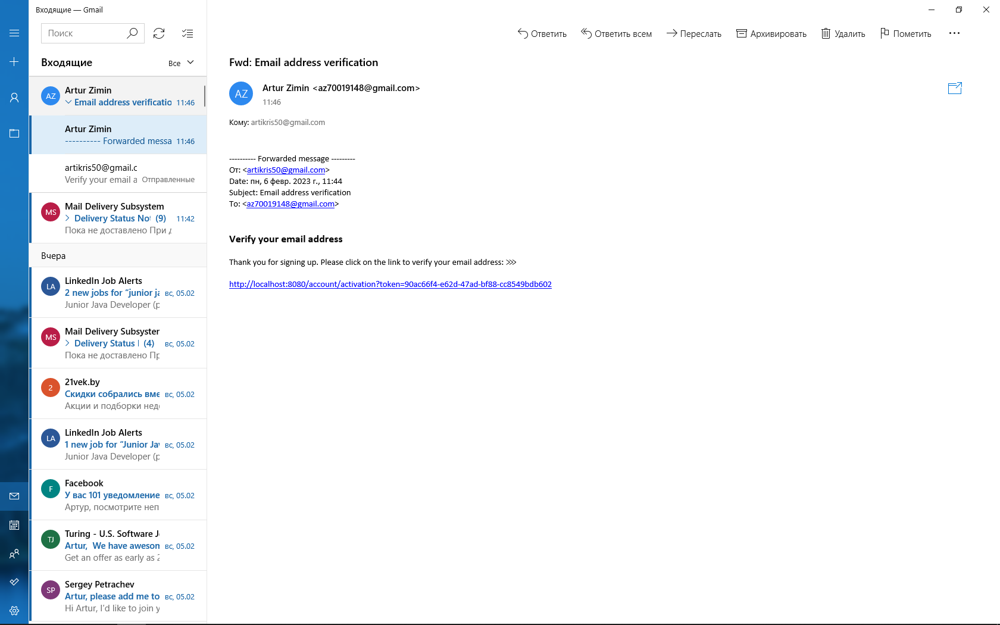
***
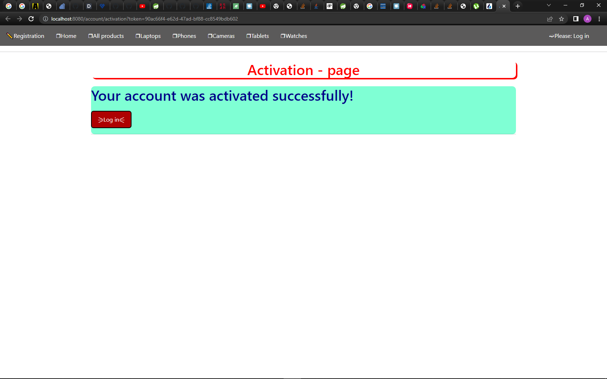
***
### Reference on video (Linkedin)
https://www.linkedin.com/posts/artur-zimin-719294212_this-is-my-final-project-activity-7012022145912332288-h6-i?utm_source=share&utm_medium=member_desktop